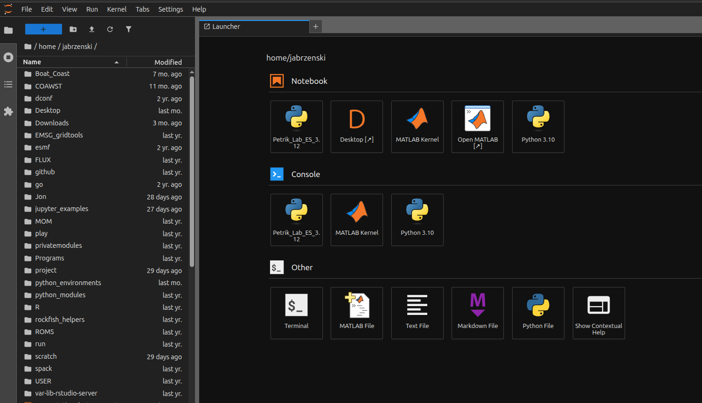
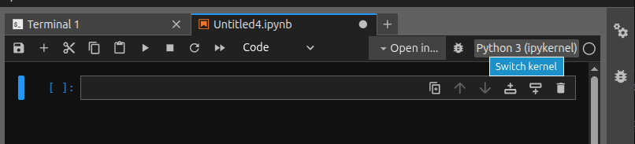
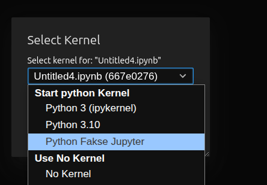

# Jupyter Hub on Rockfish

Rockfish has a permanent Jupyter-Hub running on it.

## SSH To Rockfish

The first step is to ssh into rockfish. SIO will not allow it to have an open interne tport.

```bash
ssh -N -L 8000:127.0.0.1:8000 username@rockfish.ucsd.edu
```

If run correctly, nothing should happen. This maps `my_port:my_address:rockfish_port`. The Jupyter-Hub is running on port 8000 of Rockfish.

Open up a web browser on your local computer (Chrome, Firefox, etc), and navigate to `localhost:8000`. You should see a login window.


This login is for the server, which uses the username/password combe from rockfish. Put in your rockfish username and password, and you will be logged in!

## Using The Hub

Naviagtion is on the left. Files can be navigated much like other GUI. /project and /scratch are available, navigating up the file tree.

You can open existing Jupytyer Notebooks, or create your own. The `Petrik_Lab_ES_3.12` is an environment available, built on Python 3.12, which has most every library needed for ocean and data analysis.



Some of the other features:

- Terminal is a terminal running local to rockfish, no need for another ssh.
- MATLAB can either be run as command prompt or full GUI.

## Python Environment

The core environmnet is built off of conda, and there are two environmnets available by default:

```bash
Petrik_Lab_ES_3.12       /opt/conda/envs/Petrik_Lab_ES_3.12
python310                /opt/conda/envs/python310
```

The contents of Petrik_Lab_ES are included below. If you would like something added, email Jared.

### Adding your existing environment

If you wish to add your existing environment, you need to let the Jupyter-Hub know it is available. This will only be available for you. You must do these steps from a different ssh session with rockfish, not from the terminal in the Jupyter-Hub.

Steps (on rockfish):

- source your existing environment
- insall pykernel if not already installed
  - ```python -m pip install ipykernel```
- install a link in a location Jupyter-Hub looks
  - ```python -m ipykernel install --user --name your_env_name --display-name "Python Fakse Jupyter"```

This will now be available when you are running a jupyter notebook. In the upper right corner, under kernels, you should have your environment in the drop down list.






### Petrik_Lab_ES_3.12 Contents

The base `Petrik_Lab_ES_3.12` environment contains the following:

```bash
     active environment : Petrik_Lab_ES_3.12
    active env location : /opt/conda/envs/Petrik_Lab_ES_3.12
            shell level : 2
       user config file : /home/jabrzenski/.condarc
 populated config files : /opt/conda/.condarc
          conda version : 26.5.3
    conda-build version : not installed
         python version : 3.13.14.final.0
                 solver : libmamba (default)
       virtual packages : __archspec=1=zen3
                          __conda=26.5.3=0
                          __glibc=2.39=0
                          __linux=5.14.0=0
                          __unix=0=0
       base environment : /opt/conda  (writable)
      conda av data dir : /opt/conda/etc/conda
  conda av metadata url : None
           channel URLs : https://conda.anaconda.org/conda-forge/linux-64
                          https://conda.anaconda.org/conda-forge/noarch
          package cache : /opt/conda/pkgs
                          /home/jabrzenski/.conda/pkgs
       envs directories : /opt/conda/envs
                          /home/jabrzenski/.conda/envs
    temporary directory : /tmp
               platform : linux-64
             user-agent : conda/26.5.3 requests/2.34.2 CPython/3.13.14 Linux/5.14.0-687.44.1.el9_8.x86_64 ubuntu/24.04.4 glibc/2.39 solver/libmamba conda-libmamba-solver/26.4.2 libmambapy/2.8.1
                UID:GID : 1311104:1109267
             netrc file : None
           offline mode : False

(Petrik_Lab_ES_3.12) jabrzenski@d9d6dfc7c942:~$ conda info list
usage: conda [-h] [-v] [--no-plugins] [-V] COMMAND ...
conda: error: unrecognized arguments: list
(Petrik_Lab_ES_3.12) jabrzenski@d9d6dfc7c942:~$ conda list
# packages in environment at /opt/conda/envs/Petrik_Lab_ES_3.12:
#
# Name                              Version          Build                    Channel
_openmp_mutex                       4.5              20_gnu                   conda-forge
_python_abi3_support                1.0              hd8ed1ab_3               conda-forge
affine                              3.0.0            pyhd8ed1ab_0             conda-forge
alsa-lib                            1.2.16.1         h7cc23a3_1               conda-forge
asttokens                           3.0.2            pyhd8ed1ab_0             conda-forge
attrs                               26.1.0           pyhcf101f3_0             conda-forge
aws-c-auth                          0.10.4           hb7a77c6_1               conda-forge
aws-c-cal                           0.9.14           h2aa3ae6_4               conda-forge
aws-c-common                        0.14.2           hb03c661_0               conda-forge
aws-c-compression                   0.3.2            h720e601_4               conda-forge
aws-c-event-stream                  0.7.1            h6ffeea8_4               conda-forge
aws-c-http                          0.11.0           h38ae05a_4               conda-forge
aws-c-io                            0.27.3           h6f4d18d_1               conda-forge
aws-c-mqtt                          0.16.0           h21f4ec5_2               conda-forge
aws-c-s3                            0.12.8           h46fcd08_1               conda-forge
aws-c-sdkutils                      0.2.7            h720e601_2               conda-forge
aws-checksums                       0.2.10           h720e601_4               conda-forge
aws-crt-cpp                         0.40.1           h102d43b_3               conda-forge
aws-sdk-cpp                         1.11.833         hc7390e0_9               conda-forge
azure-core-cpp                      1.16.3           h206d751_0               conda-forge
azure-identity-cpp                  1.13.3           h71f81a8_2               conda-forge
azure-storage-blobs-cpp             12.18.0          h74b55db_1               conda-forge
azure-storage-common-cpp            12.14.0          hf596fc9_1               conda-forge
azure-storage-files-datalake-cpp    12.16.0          h1f05bef_1               conda-forge
backports.zstd                      1.7.0            py312h3f22e6b_0          conda-forge
blosc                               1.21.6           he440d0b_1               conda-forge
bokeh                               3.10.0           pyhd8ed1ab_0             conda-forge
branca                              0.8.2            pyhd8ed1ab_0             conda-forge
brotli                              1.2.0            h505cf86_3               conda-forge
brotli-bin                          1.2.0            h9908984_3               conda-forge
brotli-python                       1.2.0            py312he9c40d5_3          conda-forge
bzip2                               1.0.8            hda65f42_10              conda-forge
c-ares                              1.34.8           hebe6cf0_2               conda-forge
ca-certificates                     2026.7.22        hbd8a1cb_0               conda-forge
cached-property                     2.0.1            pyhcf101f3_0             conda-forge
cached_property                     2.0.1            pyhcf101f3_0             conda-forge
cairo                               1.18.4           he90730b_1               conda-forge
cartopy                             0.25.0           np2py312h0f77346_3       conda-forge
certifi                             2026.7.22        pyhd8ed1ab_0             conda-forge
cftime                              1.6.5            py312h4f23490_1          conda-forge
charset-normalizer                  3.5.1            pyhd8ed1ab_0             conda-forge
click                               8.4.2            pyhc90fa1f_0             conda-forge
click-plugins                       1.1.1.2          pyhd8ed1ab_0             conda-forge
cligj                               0.7.2            pyhd8ed1ab_2             conda-forge
cloudpickle                         3.1.2            pyhcf101f3_1             conda-forge
cmocean                             4.0.3            pyhd8ed1ab_1             conda-forge
colorspacious                       1.1.2            pyhecae5ae_1             conda-forge
comm                                0.2.3            pyhe01879c_0             conda-forge
contourpy                           1.3.3            py312h0a2e395_4          conda-forge
cpython                             3.12.14          py312hd8ed1ab_0          conda-forge
cycler                              0.12.1           pyhcf101f3_2             conda-forge
cyrus-sasl                          2.1.28           hac629b4_1               conda-forge
cytoolz                             1.1.0            py312h4c3975b_2          conda-forge
dask                                2026.7.1         pyhc364b38_0             conda-forge
dask-core                           2026.7.1         pyhc364b38_0             conda-forge
dbus                                1.16.2           h24cb091_1               conda-forge
debugpy                             1.8.21           py312h8285ef7_0          conda-forge
distributed                         2026.7.1         pyhc364b38_0             conda-forge
double-conversion                   3.4.0            hecca717_0               conda-forge
executing                           2.2.1            pyhd8ed1ab_0             conda-forge
folium                              0.20.0           pyhd8ed1ab_0             conda-forge
font-ttf-dejavu-sans-mono           2.37             hab24e00_0               conda-forge
font-ttf-inconsolata                3.000            h77eed37_0               conda-forge
font-ttf-source-code-pro            2.038            h77eed37_0               conda-forge
font-ttf-ubuntu                     0.83             h77eed37_3               conda-forge
fontconfig                          2.18.3           h4db4eae_1               conda-forge
fonts-conda-ecosystem               1                0                        conda-forge
fonts-conda-forge                   1                hc364b38_1               conda-forge
fonttools                           4.63.0           py312h8a5da7c_0          conda-forge
freetype                            2.14.3           ha770c72_2               conda-forge
freexl                              2.0.0            h9dce30a_2               conda-forge
fribidi                             1.0.16           hb03c661_1               conda-forge
fsspec                              2026.7.0         pyhd8ed1ab_0             conda-forge
geopandas                           1.1.4            pyhd8ed1ab_0             conda-forge
geopandas-base                      1.1.4            pyha770c72_0             conda-forge
geos                                3.14.1           h480dda7_0               conda-forge
gflags                              2.3.1            h54a6638_0               conda-forge
giflib                              6.1.3            h280c20c_1               conda-forge
glog                                0.7.1            hb7133d2_1               conda-forge
graphite2                           1.3.15           h54a6638_1               conda-forge
gsw                                 3.6.23           h7c397b8_0               conda-forge
h2                                  4.4.1            pyhcf101f3_0             conda-forge
h5netcdf                            1.8.1            pyhd8ed1ab_0             conda-forge
h5py                                3.16.0           nompi_py312ha829cd9_102  conda-forge
hdf4                                4.2.15           h2a13503_7               conda-forge
hdf5                                2.1.0            nompi_h654f344_110       conda-forge
hpack                               4.2.0            pyhd8ed1ab_0             conda-forge
hyperframe                          6.1.0            pyhd8ed1ab_0             conda-forge
icu                                 78.3             py310h44b86e0_2          conda-forge
idna                                3.19             pyhcf101f3_0             conda-forge
importlib-metadata                  9.0.0            pyhcf101f3_0             conda-forge
ipykernel                           7.3.0            pyha191276_0             conda-forge
ipython                             9.16.1           pyh53cf698_0             conda-forge
ipython_pygments_lexers             1.1.1            pyhd8ed1ab_0             conda-forge
jedi                                0.20.0           pyhcf101f3_0             conda-forge
jinja2                              3.1.6            pyhcf101f3_1             conda-forge
joblib                              1.5.3            pyhd8ed1ab_0             conda-forge
json-c                              0.18             h6688a6e_0               conda-forge
jupyter_client                      8.9.1            pyhcf101f3_0             conda-forge
jupyter_core                        5.9.1            pyhc90fa1f_0             conda-forge
jupyterlab_widgets                  3.0.17           pyhcf101f3_0             conda-forge
keyutils                            1.6.3            h7cc23a3_1               conda-forge
kiwisolver                          1.5.0            py312h0a2e395_0          conda-forge
krb5                                1.22.2           hbc21106_2               conda-forge
lcms2                               2.19.1           h0c24ade_1               conda-forge
ld_impl_linux-64                    2.46.1           default_hbd61a6d_102     conda-forge
lerc                                4.2.0            hdb68285_0               conda-forge
libabseil                           20260526.0       cxx17_h0dc7533_2         conda-forge
libaec                              1.1.5            h088129d_0               conda-forge
libarchive                          3.8.9            gpl_h3152399_101         conda-forge
libarrow                            25.0.0           hcc2f0d9_4_cpu           conda-forge
libarrow-acero                      25.0.0           h635bf11_4_cpu           conda-forge
libarrow-compute                    25.0.0           h53684a4_4_cpu           conda-forge
libarrow-dataset                    25.0.0           h635bf11_4_cpu           conda-forge
libarrow-substrait                  25.0.0           h66fbfdd_4_cpu           conda-forge
libblas                             3.11.0           9_h4a7cf45_openblas      conda-forge
libbrotlicommon                     1.2.0            h39a168f_3               conda-forge
libbrotlidec                        1.2.0            ha411449_3               conda-forge
libbrotlienc                        1.2.0            h018ffa1_3               conda-forge
libcblas                            3.11.0           9_h0358290_openblas      conda-forge
libclang-cpp23.1                    23.1.0           default_h0acdd01_0       conda-forge
libclang13                          23.1.0           default_h56ed263_0       conda-forge
libcrc32c                           1.1.2            h9c3ff4c_0               conda-forge
libcups                             2.3.3            h7a8fb5f_6               conda-forge
libcurl                             8.21.0           ha042cf0_5               conda-forge
libdeflate                          1.25             hd45a770_1               conda-forge
libdrm                              2.4.129          h7cc23a3_0               conda-forge
libedit                             3.1.20250104     pl5321h373387f_1         conda-forge
libegl                              1.7.0            ha4b6fd6_5               conda-forge
libegl-devel                        1.7.0            ha4b6fd6_5               conda-forge
libev                               4.33             h280c20c_3               conda-forge
libevent                            2.1.12           hf998b51_1               conda-forge
libexpat                            2.8.1            hecca717_1               conda-forge
libffi                              3.7.0            h81df57d_1               conda-forge
libfreetype                         2.14.3           ha770c72_2               conda-forge
libfreetype6                        2.14.3           h5e6c136_2               conda-forge
libgcc                              16.2.0           ha9f2e26_4               conda-forge
libgcc-ng                           16.2.0           h69a702a_4               conda-forge
libgdal-core                        3.13.3           h5fdb907_0               conda-forge
libgfortran                         16.2.0           h69a702a_4               conda-forge
libgfortran5                        16.2.0           h6b99dfc_4               conda-forge
libgl                               1.7.0            ha4b6fd6_5               conda-forge
libgl-devel                         1.7.0            ha4b6fd6_5               conda-forge
libglib                             2.88.3           h45c3219_1               conda-forge
libglvnd                            1.7.0            ha4b6fd6_5               conda-forge
libglx                              1.7.0            ha4b6fd6_5               conda-forge
libglx-devel                        1.7.0            ha4b6fd6_5               conda-forge
libgomp                             16.2.0           he0feb66_4               conda-forge
libgoogle-cloud                     3.8.0            hbc29df5_0               conda-forge
libgoogle-cloud-storage             3.8.0            hdbdcf42_0               conda-forge
libgrpc                             1.82.1           h792040b_0               conda-forge
libharfbuzz                         14.3.1           h23af247_0               conda-forge
libhwy                              1.4.0            h57c4cff_1               conda-forge
libiconv                            1.18             h0cb94f2_3               conda-forge
libjpeg-turbo                       3.2.0            hb03c661_1               conda-forge
libjxl                              0.12.0           heb2dce7_2               conda-forge
libkml                              1.3.0            haa4a5bd_1023            conda-forge
liblapack                           3.11.0           9_h47877c9_openblas      conda-forge
libllvm23                           23.1.0           h474f4eb_0               conda-forge
liblzma                             5.8.3            hb03c661_1               conda-forge
libnetcdf                           4.10.1           nompi_he3e3c8e_201       conda-forge
libnghttp2                          1.68.1           h74cf4be_1               conda-forge
libnsl                              2.0.1            hb9d3cd8_1               conda-forge
libntlm                             1.8              hb9d3cd8_0               conda-forge
libopenblas                         0.3.34           pthreads_h94d23a6_0      conda-forge
libopengl                           1.7.0            ha4b6fd6_5               conda-forge
libopentelemetry-cpp                1.27.0           h3133023_1               conda-forge
libopentelemetry-cpp-headers        1.27.0           ha770c72_1               conda-forge
libparquet                          25.0.0           h7376487_4_cpu           conda-forge
libpciaccess                        0.19             hb03c661_1               conda-forge
libpng                              1.6.58           h922cc85_1               conda-forge
libpq                               18.6             h9d76c99_0               conda-forge
libprotobuf                         7.35.1           h622638d_3               conda-forge
libpsl                              0.23.1           hd9e3e90_1               conda-forge
libraqm                             0.11.0           h6406941_0               conda-forge
libre2-11                           2025.11.05       h60473fc_2               conda-forge
librttopo                           1.1.0            h46dd2a8_20              conda-forge
libsodium                           1.0.22           hebe6cf0_2               conda-forge
libspatialite                       5.1.0            gpl_hab3fe16_120         conda-forge
libsqlite                           3.53.4           h13e7031_1               conda-forge
libssh2                             1.11.1           h6154650_1               conda-forge
libstdcxx                           16.2.0           h934c35e_4               conda-forge
libstdcxx-ng                        16.2.0           hdf11a46_4               conda-forge
libthrift                           0.22.0           h7d032f7_2               conda-forge
libtiff                             4.7.2            hcc2c06a_1               conda-forge
libutf8proc                         2.11.3           hfe17d71_0               conda-forge
libuuid                             2.42.2           h5347b49_0               conda-forge
libvulkan-loader                    1.4.357.0        h0e34353_2               conda-forge
libwebp-base                        1.6.0            hd42ef1d_1               conda-forge
libxcb                              1.17.0           hb83e432_1               conda-forge
libxcrypt                           4.4.38           h280c20c_0               conda-forge
libxkbcommon                        1.13.2           h51789e4_1               conda-forge
libxml2                             2.15.3           h49c6c72_1               conda-forge
libxml2-16                          2.15.3           hca6bf5a_1               conda-forge
libxml2-devel                       2.15.3           h49c6c72_1               conda-forge
libxslt                             1.1.43           h711ed8c_1               conda-forge
libzip                              1.11.2           h6991a6a_0               conda-forge
libzlib                             1.3.2            h25fd6f3_3               conda-forge
locket                              1.0.0            pyhd8ed1ab_0             conda-forge
lz4                                 4.4.5            py312h3d67a73_1          conda-forge
lz4-c                               1.10.0           hee9eb32_2               conda-forge
lzo                                 2.10             hebe6cf0_1003            conda-forge
mapclassify                         2.11.0           pyhd8ed1ab_0             conda-forge
markupsafe                          3.0.3            py312h8a5da7c_1          conda-forge
matplotlib                          3.11.1           py312h6a12a82_2          conda-forge
matplotlib-base                     3.11.1           py312h4c94fcb_2          conda-forge
matplotlib-inline                   0.2.2            pyhd8ed1ab_0             conda-forge
minizip                             4.2.2            hb71707f_0               conda-forge
msgpack-python                      1.2.1            py312h0a2e395_1          conda-forge
munkres                             1.1.4            pyhd8ed1ab_1             conda-forge
muparser                            2.3.5            h5888daf_0               conda-forge
narwhals                            2.25.0           pyhcf101f3_0             conda-forge
ncurses                             6.6              hdb14827_1               conda-forge
nest-asyncio2                       1.7.2            pyhcf101f3_0             conda-forge
netcdf4                             1.7.4            nompi_py311hb115678_109  conda-forge
networkx                            3.6.1            pyhcf101f3_0             conda-forge
nlohmann_json                       3.12.0           h54a6638_2               conda-forge
numpy                               2.5.2            py312h33ff503_0          conda-forge
openjpeg                            2.5.4            h55fea9a_0               conda-forge
openldap                            2.6.13           hbde042b_0               conda-forge
openssl                             3.6.4            h781a0a9_0               conda-forge
orc                                 2.3.1            h443056b_0               conda-forge
packaging                           26.3             pyhc364b38_0             conda-forge
pandas                              3.0.5            py312h8ecdadd_1          conda-forge
parso                               0.8.7            pyhcf101f3_0             conda-forge
partd                               1.4.2            pyhd8ed1ab_0             conda-forge
patsy                               1.0.2            pyhcf101f3_0             conda-forge
pcre2                               10.47            h8b3dc9c_1               conda-forge
pexpect                             4.9.0            pyhd8ed1ab_1             conda-forge
pillow                              12.3.0           py312h50c33e8_0          conda-forge
pip                                 26.2.1           pyh8b19718_0             conda-forge
pixman                              0.46.4           h54a6638_3               conda-forge
platformdirs                        4.11.4           pyhcf101f3_0             conda-forge
proj                                9.8.1            he0df7b0_0               conda-forge
prometheus-cpp                      1.3.0            ha5d0236_0               conda-forge
prompt-toolkit                      3.0.53           pyha770c72_0             conda-forge
psutil                              7.2.2            py312h1b36aeb_1          conda-forge
pthread-stubs                       0.4              hb03c661_1003            conda-forge
ptyprocess                          0.7.0            pyhd8ed1ab_1             conda-forge
pure_eval                           0.2.3            pyhd8ed1ab_1             conda-forge
pyarrow                             25.0.0           py312h7900ff3_0          conda-forge
pyarrow-core                        25.0.0           py312h2054cf2_0_cpu      conda-forge
pygments                            2.21.0           pyhcf101f3_0             conda-forge
pyogrio                             0.13.0           py312hdb6ebaa_0          conda-forge
pyparsing                           3.3.2            pyhcf101f3_0             conda-forge
pyproj                              3.7.2            py312hbc8341d_5          conda-forge
pyshp                               3.1.6            pyhcf101f3_0             conda-forge
pyside6                             6.11.2           py312hf143aa3_0          conda-forge
pysocks                             1.7.1            pyha55dd90_7             conda-forge
python                              3.12.14          h8ab3286_0_cpython       conda-forge
python-dateutil                     2.9.0.post0      pyhe01879c_2             conda-forge
python-gil                          3.12.14          hd8ed1ab_0               conda-forge
python_abi                          3.12             8_cp312                  conda-forge
pyyaml                              6.0.3            py312h8a5da7c_1          conda-forge
pyzmq                               27.2.0           py312h8a5ba0d_0          conda-forge
qhull                               2020.2           h434a139_5               conda-forge
qt6-main                            6.11.2           pl5321h9df5c37_0         conda-forge
rasterio                            1.5.1            py312h5d657d5_1          conda-forge
re2                                 2025.11.05       h94463f1_2               conda-forge
readline                            8.3              hd6e31c0_1               conda-forge
requests                            2.34.2           pyhcf101f3_0             conda-forge
rioxarray                           0.23.0           pyhc364b38_0             conda-forge
s2n                                 1.7.5            h7e3ee7f_1               conda-forge
scikit-learn                        1.9.0            np2py312h3226591_0       conda-forge
scipy                               1.18.0           py312h54fa4ab_0          conda-forge
seaborn                             0.13.2           hd8ed1ab_3               conda-forge
seaborn-base                        0.13.2           pyhd8ed1ab_3             conda-forge
setuptools                          84.0.0           pyh332efcf_0             conda-forge
shapely                             2.1.2            py312h383787d_2          conda-forge
six                                 1.17.0           pyhe01879c_1             conda-forge
snappy                              1.2.2            h03e3b7b_1               conda-forge
snuggs                              1.4.7            pyhd8ed1ab_2             conda-forge
sortedcontainers                    2.4.0            pyhd8ed1ab_1             conda-forge
sqlite                              3.53.4           h9ffa6c4_1               conda-forge
stack_data                          0.6.3            pyhd8ed1ab_1             conda-forge
statsmodels                         0.14.6           py312h4f23490_0          conda-forge
tblib                               3.2.2            pyhcf101f3_0             conda-forge
threadpoolctl                       3.6.0            pyhecae5ae_0             conda-forge
tk                                  8.6.13           noxft_h1df4ec4_4         conda-forge
toolz                               1.1.0            pyhd8ed1ab_1             conda-forge
tornado                             6.5.8            py312h4c3975b_0          conda-forge
traitlets                           5.16.1           pyhcf101f3_0             conda-forge
typing_extensions                   4.16.0           pyhcf101f3_0             conda-forge
tzdata                              2026c            h151e31d_0               conda-forge
unicodedata2                        17.0.1           py312h4c3975b_0          conda-forge
uriparser                           0.9.8            hac33072_0               conda-forge
urllib3                             2.7.0            pyhd8ed1ab_0             conda-forge
wayland                             1.26.0           h1964d1d_1               conda-forge
wcwidth                             0.8.2            pyhd8ed1ab_0             conda-forge
wheel                               0.48.0           pyhd8ed1ab_0             conda-forge
xarray                              2026.7.0         pyhc364b38_0             conda-forge
xcb-util                            0.4.1            h4f16b4b_2               conda-forge
xcb-util-cursor                     0.1.6            hb03c661_0               conda-forge
xcb-util-image                      0.4.0            hb711507_2               conda-forge
xcb-util-keysyms                    0.4.1            hb711507_0               conda-forge
xcb-util-renderutil                 0.3.10           hb711507_0               conda-forge
xcb-util-wm                         0.4.2            hb711507_0               conda-forge
xerces-c                            3.3.0            hd9031aa_1               conda-forge
xkeyboard-config                    2.48             h280c20c_0               conda-forge
xoak                                0.2.0            pyhd8ed1ab_0             conda-forge
xorg-libice                         1.1.2            h280c20c_0               conda-forge
xorg-libsm                          1.2.6            h0d788c3_1               conda-forge
xorg-libx11                         1.8.13           he1eb515_1               conda-forge
xorg-libxau                         1.0.12           hb03c661_2               conda-forge
xorg-libxcomposite                  0.4.7            hb03c661_0               conda-forge
xorg-libxcursor                     1.2.3            hb9d3cd8_0               conda-forge
xorg-libxdamage                     1.1.6            hb9d3cd8_0               conda-forge
xorg-libxdmcp                       1.1.5            hb03c661_2               conda-forge
xorg-libxext                        1.3.7            h7cc23a3_1               conda-forge
xorg-libxfixes                      6.0.2            h7cc23a3_1               conda-forge
xorg-libxi                          1.8.3            h7cc23a3_1               conda-forge
xorg-libxrandr                      1.5.5            h7cc23a3_1               conda-forge
xorg-libxrender                     0.9.12           hb03c661_1               conda-forge
xorg-libxtst                        1.2.5            h7cc23a3_4               conda-forge
xorg-libxxf86vm                     1.1.7            hb03c661_0               conda-forge
xorg-xorgproto                      2025.1           h280c20c_1               conda-forge
xyzservices                         2026.3.0         pyhd8ed1ab_0             conda-forge
yaml                                0.2.5            hebe6cf0_3               conda-forge
zeromq                              4.3.5            h09e67af_11              conda-forge
zict                                3.0.0            pyhd8ed1ab_1             conda-forge
zipp                                4.1.0            pyhcf101f3_0             conda-forge
zlib                                1.3.2            h25fd6f3_3               conda-forge
zlib-ng                             2.3.3            hce19668_1               conda-forge
zstd                                1.5.7            hb78ec9c_7               conda-forge
```
